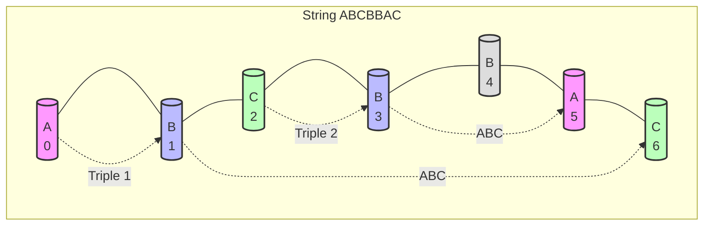
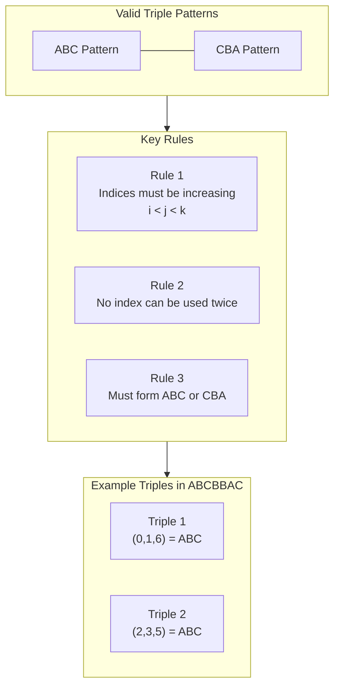
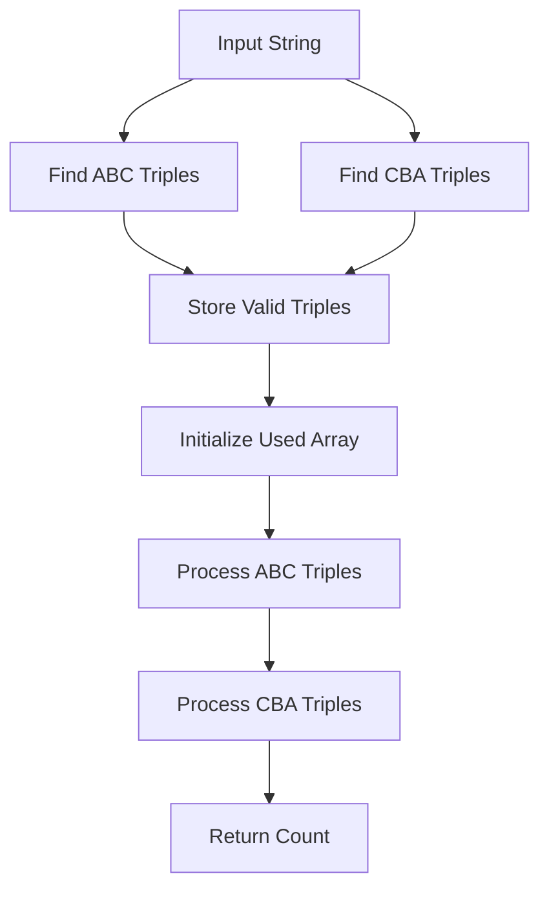
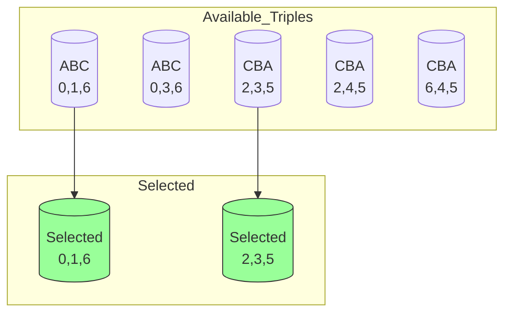

# Brain and Intelligence exercise

## Mental Games

### Game 1: Quick Triple Finder
- **Setup**: Create a string of length 7-8 using only A, B, C in your mind
- **Exercise**: 
  1. Give yourself 10 seconds
  2. Try to find all ABC or CBA triples mentally
  3. Keep track of used indices
  4. Count maximum non-overlapping triples
- **Example**: Visualize "ABCBCAB"
- **Difficulty**: Start with 7 letters, increase as you improve

### Game 2: Pattern Recognition Race
- **Setup**: Have someone tell you a string of A, B, C
- **Exercise**:
  1. First 5 seconds: Find all ABC patterns
  2. Next 5 seconds: Find all CBA patterns
  3. Final 5 seconds: Eliminate overlapping ones
- **Goal**: Improve pattern recognition speed

### Game 3: Index Memory Challenge
- **Setup**: Create a string mentally
- **Exercise**:
  1. Find first ABC pattern
  2. Remember those indices
  3. Find CBA pattern that doesn't overlap
  4. Keep both sets of indices in mind
- **Benefits**: Improves working memory and spatial reasoning

### Game 4: Prediction Game
- **Setup**: Start revealing a string one character at time
- **Exercise**:
  1. After each character, predict maximum possible triples
  2. Update prediction as new characters are revealed
  3. Compare final prediction with actual answer
- **Benefits**: Develops forward thinking and probability estimation

# Visualization of the problem statement

## String Structure Visualization



## Triple Formation Visualization



# Visualization of the solution

## Algorithm Flow



## Triple Selection Process



Given a string S containing only characters 'A', 'B', and 'C', we need to find triples of indices that form either "ABC" or "CBA" when read in order. For example:

For string "ABCBBAC":
```
Index: 0 1 2 3 4 5 6
      A B C B B A C
```

Valid triples:
1. (0,1,6) → A,B,C forms ABC
2. (2,3,5) → C,B,A forms CBA

Important constraints:
- Each index can only be used once
- Indices must be in strictly increasing order (i < j < k)

# Visualization of the solution

## Approach

1. First, we need to find all possible triples that form either "ABC" or "CBA"
2. Then, we need to select the maximum number of non-overlapping triples

For example, in "ABCBBAC":
```
Possible ABC triples:
- (0,1,6) → A,B,C
- (0,3,6) → A,B,C

Possible CBA triples:
- (2,3,5) → C,B,A
- (2,4,5) → C,B,A
- (6,4,5) → C,B,A

Maximum non-overlapping selection:
- Choose (0,1,6) and (2,3,5)
```

## Algorithm Steps

1. Find all possible triples that form ABC or CBA
2. Create a graph where:
   - Each triple is a vertex
   - Edge between triples if they share any index
3. Find the maximum independent set in this graph
   - In this case, we can use a greedy approach because of the problem's properties

# Codeforces Code

```cpp
#include <bits/stdc++.h>
using namespace std;

int solve(string& s) {
    int n = s.length();
    vector<tuple<int,int,int>> abc, cba;
    
    // Find all possible ABC and CBA triples
    for(int i = 0; i < n-2; i++) {
        for(int j = i+1; j < n-1; j++) {
            for(int k = j+1; k < n; k++) {
                if(s[i] == 'A' && s[j] == 'B' && s[k] == 'C') {
                    abc.push_back({i,j,k});
                }
                if(s[i] == 'C' && s[j] == 'B' && s[k] == 'A') {
                    cba.push_back({i,j,k});
                }
            }
        }
    }
    
    // Greedy selection of non-overlapping triples
    int result = 0;
    vector<bool> used(n, false);
    
    auto tryAdd = [&](tuple<int,int,int>& t) {
        int i = get<0>(t), j = get<1>(t), k = get<2>(t);
        if(!used[i] && !used[j] && !used[k]) {
            used[i] = used[j] = used[k] = true;
            result++;
            return true;
        }
        return false;
    };
    
    // Try ABC triples first, then CBA triples
    for(auto& t : abc) {
        tryAdd(t);
    }
    for(auto& t : cba) {
        tryAdd(t);
    }
    
    return result;
}

int main() {
    string s;
    cin >> s;
    cout << solve(s) << endl;
    return 0;
}
```

## Time Complexity
- Finding all triples: O(n³)
- Greedy selection: O(n³)
- Overall: O(n³)

## Space Complexity
- O(n³) to store all possible triples
- O(n) for the used array
- Overall: O(n³)
