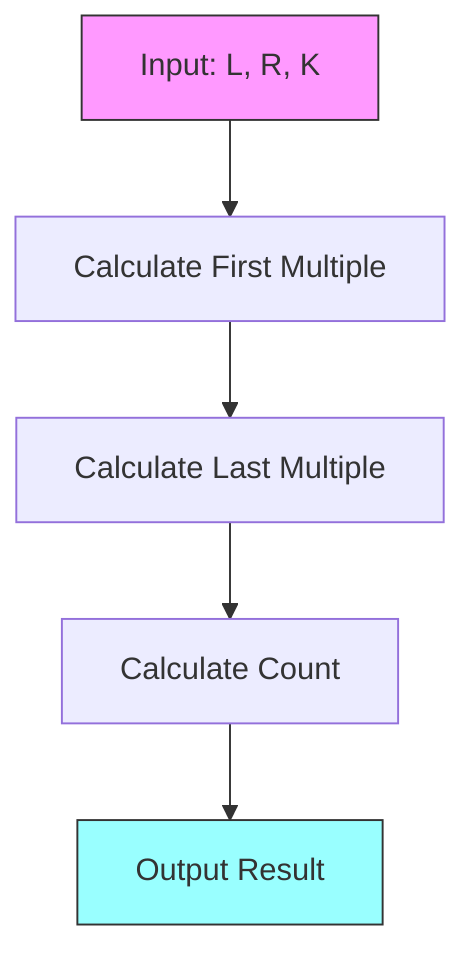

# Solution: Arithmetica's Problem

## Approach

The problem can be solved in O(1) time by using mathematical formulas to find the count of multiples in a range.



## Solution Steps

1. **Find First Multiple**
   - Calculate the first multiple of K that is ≥ L
   - Formula: `firstMultiple = Math.floor((L + K - 1) / K) * K`
   - This rounds up L/K to the next integer and multiplies by K

2. **Find Last Multiple**
   - Calculate the last multiple of K that is ≤ R
   - Formula: `lastMultiple = Math.floor(R / K) * K`
   - This rounds down R/K and multiplies by K

3. **Count Multiples**
   - If firstMultiple > R, return 0 (no multiples exist)
   - Otherwise, use arithmetic sequence formula
   - Formula: `(lastMultiple - firstMultiple) / K + 1`

## Example Walkthrough

For input: L = 13, R = 27, K = 5

1. First multiple:
   ```
   firstMultiple = Math.floor((13 + 5 - 1) / 5) * 5
                 = Math.floor(17 / 5) * 5
                 = 3 * 5
                 = 15
   ```

2. Last multiple:
   ```
   lastMultiple = Math.floor(27 / 5) * 5
                = 5 * 5
                = 25
   ```

3. Count:
   ```
   count = (25 - 15) / 5 + 1
        = 10 / 5 + 1
        = 2 + 1
        = 3
   ```

Therefore, there are 3 multiples: 15, 20, and 25.

## Edge Cases

1. When L = R:
   ```javascript
   // Example: L = 10, R = 10, K = 2
   // Returns 1 if L is multiple of K, 0 otherwise
   ```

2. When K > R:
   ```javascript
   // Example: L = 1, R = 5, K = 10
   // Returns 0 as no multiples exist
   ```

3. When L is multiple of K:
   ```javascript
   // Example: L = 15, R = 20, K = 5
   // First multiple is L itself
   ```

## Time and Space Complexity

- Time Complexity: O(1)
- Space Complexity: O(1)
- All operations are simple arithmetic calculations

## Code Implementation

```javascript
// run on javascript V8 4.8.0
// https://codeforces.com/contest/105979/problem/A

function main() {
    // Read input
    var input = readline().split(' ').map(Number);
    var L = input[0];
    var R = input[1];
    var K = input[2];
    
    // Call solve() and print result
    print(solve(L, R, K));
}

function solve(L, R, K) {
    // Find first multiple of K greater than or equal to L
    var firstMultiple = Math.floor((L + K - 1) / K) * K;
    
    // Find last multiple of K less than or equal to R
    var lastMultiple = Math.floor(R / K) * K;
    
    // If first multiple is greater than R, no multiples exist
    if (firstMultiple > R) {
        return 0;
    }
    
    // Count multiples using arithmetic sequence formula
    return Math.floor((lastMultiple - firstMultiple) / K) + 1;
}

// Run solution
main(); 
``` 