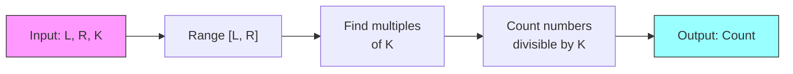

# A. Arithmetica's problem

## Problem Statement

In the land of Arithmetica, the wise mathematician Numeron is known for solving intricate numerical puzzles. One day, Numeron encounters a problem involving a range of numbers and a special integer $K$. The challenge is to determine how many numbers within a given range are multiples of $K$. Your task is to help Numeron by calculating the number of multiples of $K$ within the interval $[L, R]$.

## Input

The first line contains three integers $L$, $R$, and $K$ ($1 \leq L \leq R \leq 1000$, $1 \leq K \leq 1000$), representing the start and end of the interval and the special integer, respectively.

## Output

Output a single integer representing the count of numbers within the interval $[L, R]$ that are multiples of $K$.

## Examples

### Input 1
```
1 10 2
```
### Output 1
```
5
```

### Input 2
```
1 10 3
```
### Output 2
```
3
```

### Input 3
```
13 27 5
```
### Output 3
```
3
```

## Visualization



## Problem Analysis

1. **Problem Type**: This is a mathematical problem focusing on divisibility and range counting.

2. **Key Concepts**:
   - Range boundaries $[L, R]$
   - Divisibility by $K$
   - Counting multiples in a range

3. **Solution Approach**:
   - Find the first multiple of $K$ that is greater than or equal to $L$
   - Find the last multiple of $K$ that is less than or equal to $R$
   - Count the number of multiples in between (inclusive)

4. **Example Walkthrough** (using first example where $L=1$, $R=10$, $K=2$):
   - Range: $[1, 10]$
   - Multiples of 2 in this range: 2, 4, 6, 8, 10
   - Count: 5 numbers

5. **Edge Cases to Consider**:
   - When $L = R$
   - When $K$ is larger than $R$
   - When $L$ is already a multiple of $K$

6. **Time Complexity**:
   - The solution can be implemented in $O(1)$ time using mathematical formula
   - No need to iterate through the range
