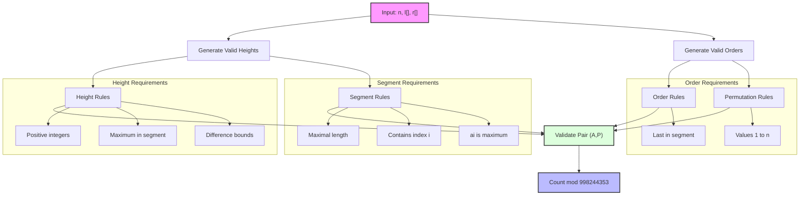

# B. Building Skyscrapers

The Legendary Huron is planning the construction of $n$ skyscrapers on a major street in Huronland that runs from west to east. The final skyline will be an array of **positive** integers $A = [a_1, a_2, \dots, a_n]$, where $a_i$ is the height of the $i$-th skyscraper from the west. The order of construction and the heights are yet to be decided. For safety reasons, **only one skyscraper can be built at a time**.

After all skyscrapers are completed, the Tourism Office will promote each one using a panoramic photo. For each skyscraper $i$, the office selects the longest contiguous segment of skyscrapers that includes $i$, such that the maximum height in the segment is $a_i$, and takes a photo of such segment. A photo is considered successful if:

1. Skyscraper $i$ is the **last one built** among all skyscrapers in the photo.
2. Let $k$ be the number of skyscrapers in the segment and $d$ the absolute difference between the maximum and second maximum heights in it. Then $d$ must satisfy $l_k \leq d \leq r_k$, where $l_k$ and $r_k$ are input integers. If the segment contains only one skyscraper, the second maximum is considered $0$. For example, the segment $[4, 9, 1, 3]$ has $d = 5$; the segment $[2, 1, 2]$ has $d = 0$; and the segment $[4]$ has $d = 4$.

The Tourism Office asks the Legendary Huron to assign positive heights and a construction order so that **all $n$ photos are successful**. Two plans are different if the heights or construction order differ. Determine the number of such valid plans, modulo $998244353$.

## Input

The first line contains $n$ ($1 \leq n \leq 5 \cdot 10^5$).

Then $n$ lines follows, where the $(i+1)$-th line contains two integers $l_i$ and $r_i$ ($0 \leq l_i \leq r_i \leq 10^9$).

## Output

Print the answer modulo $998244353$.

## Examples

### Input 1
```
1
1 10
```
### Output 1
```
10
```

### Input 2
```
1
0 0
```
### Output 2
```
0
```

### Input 3
```
2
1 4
5 7
```
### Output 3
```
24
```

### Input 4
```
3
1 1
2 2
3 3
```
### Output 4
```
6
```

## Problem Analysis

1. For each skyscraper $i$:
   - It must be the last built in its photo segment
   - The segment must be the longest possible where $a_i$ is the maximum
   - The difference $d$ between $a_i$ and the second highest must satisfy $l_k \leq d \leq r_k$

2. Key Constraints:
   - All heights must be positive integers
   - Each skyscraper must be built one at a time
   - The construction order matters
   - All $n$ photos must be successful

3. Solution must consider:
   - Valid height assignments
   - Valid construction orders
   - Modulo arithmetic with $998244353$

## Mathematical Abstraction

Given a positive integer $n$, find the number of valid pairs $(A, P)$ where:

- $A = [a_1, a_2, \dots, a_n]$ is an array of positive integers
- $P = [p_1, p_2, \dots, p_n]$ is a permutation of $[1,2,\dots,n]$ representing the order

For each index $i \in [1,n]$, let:
- $S_i$ be the longest contiguous segment containing $i$ where $a_i = \max(S_i)$
- $k_i = |S_i|$ be the length of segment $S_i$
- $d_i = a_i - \max_{j \in S_i, j \neq i} a_j$ be the difference between maximum and second maximum
  - If $|S_i| = 1$, then $d_i = a_i$

The pair $(A, P)$ is valid if and only if for all $i \in [1,n]$:
1. $p_i > p_j$ for all $j \in S_i, j \neq i$ (built last in segment)
2. $l_{k_i} \leq d_i \leq r_{k_i}$ (difference constraint)

Output the number of valid pairs modulo $998244353$.

### Key Properties

1. **Segment Property**: For any index $i$, its segment $S_i$ must be maximal:
   - Cannot extend left: $a_{left-1} > a_i$ if exists
   - Cannot extend right: $a_{right+1} > a_i$ if exists
   - All values in segment $\leq a_i$

2. **Order Property**: For each segment $S_i$:
   - $i$ must have the highest position value in $P$ among all indices in $S_i$
   - This creates a partial ordering constraint on $P$

3. **Height Property**: For each segment $S_i$:
   - $a_i$ must be the maximum in its segment
   - The difference to second maximum must satisfy the given bounds
   - All heights must be positive integers

### Visual Representation



### Example Analysis

For $n=2$ with constraints $l_1=1, r_1=4$ and $l_2=5, r_2=7$:

1. Consider segment lengths:
   - Each position can have segment length 1 or 2
   - If length=1: difference is the height itself
   - If length=2: difference is between max and second max

2. Valid height assignments must ensure:
   - For length=1: $1 \leq a_i \leq 4$ for first position
   - For length=1: $5 \leq a_i \leq 7$ for second position
   - For length=2: differences must satisfy both constraints

3. Valid order assignments must ensure:
   - If segments overlap, the maximum must be built last
   - Results in partial ordering constraints on the permutation

This leads to 24 valid combinations in total.
