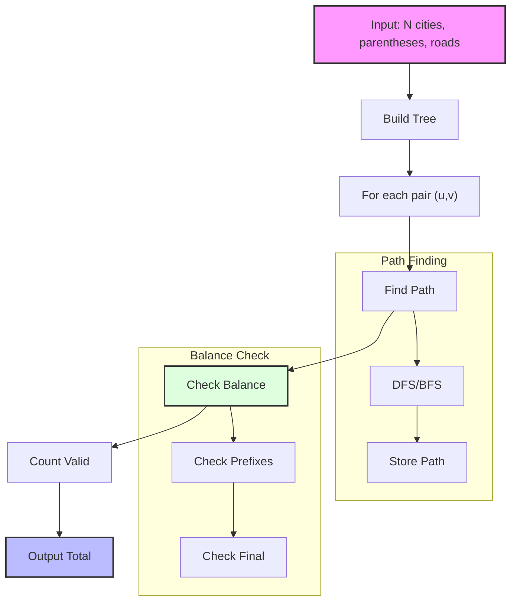

# L. Lemmings's Path

In the whimsical country of Ratania, there are $n$ cities numbered from $1$ to $n$. The cities are connected by $n-1$ roads, forming a tree.

Each city contains a single parenthesis character, either '(' or ')'.

The inhabitants of Ratania, known as Los Ratones, want to place magical portals between pairs of cities. A portal can only be placed between two distinct cities $u$ and $v$ if the path from $u$ to $v$ (following roads through the tree) forms a balanced parentheses sequence, when concatenating the characters of all cities along the path (including both endpoints).

A balanced parentheses sequence is defined as:
- Every prefix of the sequence contains at least as many '(' as ')'
- The total number of '(' is equal to the number of ')'

Los Ratones, however, are currently busy training for a prestigious international tournament, and they simply don't have time to figure this out themselves. That's why they've turned to you — a legendary expert in tree data structures and parentheses sorcery.

They want to know: How many different portals can they place?

## Input

The first line of input contains one integer, $N$ $(1 \leq N \leq 100000)$, the number of cities in Ratania.

The second line contains $N$ characters representing what each city contains '(' or ')'.

Each of the next $N-1$ lines contains two integers $X$ and $Y$ $(1 \leq X, Y \leq N, X \ne Y)$, meaning there's a road between $X$ and $Y$.

## Output

Print the number of different portals that they can place.

## Examples

### Input 1
```
5
(()))
1 2
1 3
3 4
3 5
```
### Output 1
```
3
```

### Input 2
```
6
((()))
1 2
1 3
1 4
4 5
4 6
```
### Output 2
```
5
```

### Input 3
```
8
)))()(((
1 2
2 3
3 4
4 5
5 6
6 7
7 8
```
### Output 3
```
6
```

## Solution Approach

1. For each pair of cities $(u,v)$:
   - Find the unique path between them in the tree
   - Check if the concatenated parentheses sequence is balanced

2. Key Properties:
   - The path between any two cities in a tree is unique
   - A sequence is balanced if:
     * Every prefix has non-negative balance (more '(' than ')')
     * Final balance is zero (equal number of '(' and ')')

3. Implementation:
   - Use DFS/BFS to find paths between cities
   - For each path, check if it forms a valid sequence
   - Count valid portal placements

4. Time Complexity:
   - For each pair of cities: $O(N^2)$
   - Path finding and validation: $O(N)$
   - Total: $O(N^3)$

### Visual Representation



### Example Analysis

For the first example:
```
5 cities: (()))
Tree:
1 -- 2
1 -- 3
3 -- 4
3 -- 5
```

Valid portal placements:
1. Between cities with balanced sequences
2. Must consider all paths through the tree
3. Count each valid pair exactly once
