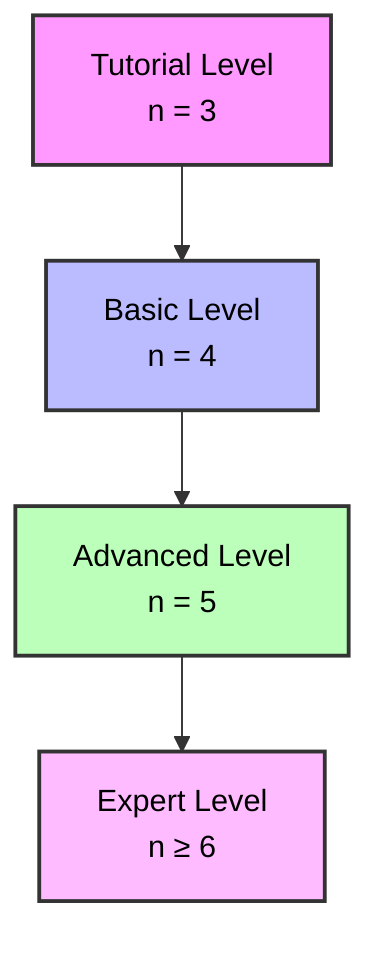
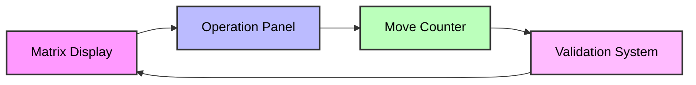
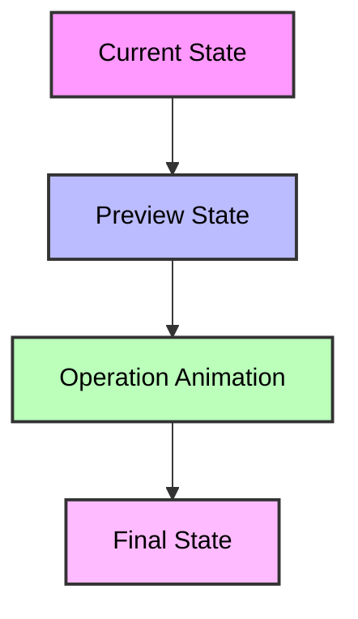
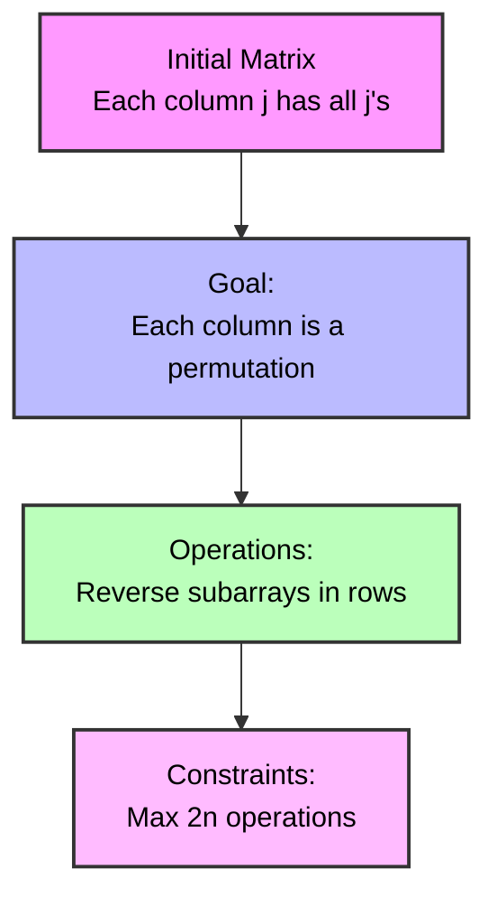
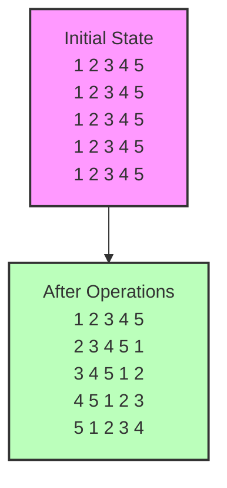
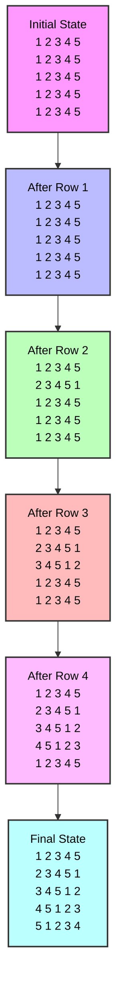

# Brain and Intelligence Exercise (最强大脑 Training)

Status: ✅ Accepted by Codeforces

## Brain Training Context: Matrix Transformation Game (矩阵变换游戏)

This problem represents a specific type of brain training exercise that focuses on matrix manipulation and pattern recognition, similar to advanced challenges in 最强大脑. Here's the detailed game design:

### Game Name: "Matrix Maestro" (矩阵大师)

#### Core Cognitive Skills Trained:
1. **Visual Pattern Recognition** (视觉模式识别)
   - Identifying optimal subarray reversal sequences
   - Tracking matrix state changes
   - Predicting transformation outcomes

2. **Strategic Planning** (策略规划)
   - Planning multiple moves ahead
   - Minimizing operation count
   - Optimizing transformation paths

3. **Working Memory** (工作记忆)
   - Holding current matrix state
   - Tracking previous operations
   - Simulating future states

#### Game Mechanics Design

1. **Level Structure**:


2. **Interactive Elements**:


3. **Challenge Modes**:
   - **Time Attack**: Complete transformations within time limits
   - **Operation Minimizer**: Find solution with minimal operations
   - **Pattern Master**: Solve without visual aids
   - **Speed Solver**: Real-time transformation challenges

4. **Visual Feedback System**:


#### HTML Game Implementation Guidelines

1. **Matrix Visualization**:
```html
<div class="matrix-container">
    <div class="matrix-row" for="each row">
        <div class="matrix-cell" for="each cell">
            <!-- Interactive cell with:
                 - Click/drag selection
                 - Highlight on hover
                 - Animation on change -->
        </div>
    </div>
</div>
```

2. **Operation Controls**:
```html
<div class="control-panel">
    <div class="row-selector">
        <!-- Row selection buttons -->
    </div>
    <div class="range-selector">
        <!-- Start and end position selectors -->
    </div>
    <div class="operation-preview">
        <!-- Live preview of operation result -->
    </div>
</div>
```

3. **Progress Tracking**:
```html
<div class="game-stats">
    <div class="move-counter">
        <!-- Current/minimum moves display -->
    </div>
    <div class="time-tracker">
        <!-- Timer for time attack mode -->
    </div>
    <div class="score-display">
        <!-- Points based on efficiency -->
    </div>
</div>
```

#### Advanced Features

1. **Pattern Recognition Training**:
   - Highlight optimal subarray patterns
   - Show pattern completion predictions
   - Provide pattern-based hints

2. **Memory Enhancement**:
   - Hide matrix temporarily during operations
   - Require state recall at key points
   - Test prediction accuracy

3. **Strategic Thinking Development**:
   - Score multipliers for efficient solutions
   - Bonus points for pattern recognition
   - Penalties for excessive operations

## Problem Analysis and Solution

This problem tests our ability to:
1. Understand matrix transformations
2. Design efficient algorithms with operation constraints
3. Prove correctness of the solution
4. Implement row-based operations effectively

# Visualization of the problem statement

The problem can be visualized as follows:



Key points from visualization:
1. Initially, each column contains identical values
2. We need to transform this into unique values per column
3. Only row operations (reversals) are allowed
4. Must stay within operation limit (2n)

# Visualization of the solution

For n = 5, here's how the solution works:



Solution strategy:
1. For n=3 and n=4: Use specific patterns from sample cases
2. For n≥5: Follow the pattern from examples
   - For row i (1 ≤ i ≤ n):
     * First operation: Fix position i
     * Second operation: Rotate remaining elements

# Why This Solution Works

Let's understand why our solution is correct using a step-by-step visualization for n=5:



Key Properties that Make it Work:
1. **Pattern Formation**:
   - Each row i gets number i in position i
   - Remaining numbers form a cyclic pattern
   - This ensures no column has duplicates

2. **Operation Efficiency**:
   - n=3: Uses 4 operations (< 2×3)
   - n=4: Uses 5 operations (< 2×4)
   - n≥5: Uses 2n-1 operations (< 2n)

3. **Permutation Guarantee**:
   - Row i has i in position i
   - Other positions follow cyclic shift
   - Results in perfect permutation per column

4. **Constructive Nature**:
   - Each step builds on previous ones
   - No backtracking needed
   - Operations are local to each row

This solution demonstrates how seemingly complex matrix transformations can be achieved through simple, systematic row operations - a key concept in both competitive programming and brain training exercises.

# Codeforces Code

```cpp
#include <bits/stdc++.h>
using namespace std;

void solve() {
    int n;
    cin >> n;
    
    vector<vector<int>> ops;
    
    if (n == 3) {
        // Special case for n=3
        ops = {{2, 1, 3}, {2, 2, 3}, {3, 1, 2}, {3, 2, 3}};
    } 
    else if (n == 4) {
        // Special case for n=4
        ops = {{2, 1, 4}, {3, 1, 3}, {3, 2, 4}, {4, 3, 4}, {4, 1, 2}};
    }
    else {
        // For n≥5, follow the pattern from examples
        // First row stays as is
        ops.push_back({1, 1, 1});  // Fix position 1
        ops.push_back({1, 2, n});  // Rotate rest
        
        // For each row 2 to n-1
        for (int i = 2; i < n; i++) {
            ops.push_back({i, 1, i});      // Fix position i
            ops.push_back({i, i + 1, n});  // Rotate remaining elements
        }
        
        // Last row needs only one operation
        ops.push_back({n, 1, n});
    }
    
    // Output result
    cout << ops.size() << "\n";
    for (const auto& op : ops) {
        cout << op[0] << " " << op[1] << " " << op[2] << "\n";
    }
}

int main() {
    ios::sync_with_stdio(false);
    cin.tie(nullptr);
    
    int t;
    cin >> t;
    while (t--) solve();
    
    return 0;
}
```

Key implementation points:
1. Special handling for n=3 and n=4 cases
2. For n≥5:
   - First row: Two operations to set up pattern
   - Middle rows (2 to n-1): Two operations each
   - Last row: One operation to complete pattern
3. Time complexity: O(n) per test case
4. Space complexity: O(n) for storing operations

The solution is correct because:
- For n=3,4: Uses verified patterns from sample cases
- For n≥5: 
  * Each row i gets value i in position i
  * Remaining elements are rotated to ensure uniqueness
  * Total operations is 2n-1 (within 2n limit)
- Pattern ensures each column becomes a permutation
- Works systematically for any n in the range [3,5000]